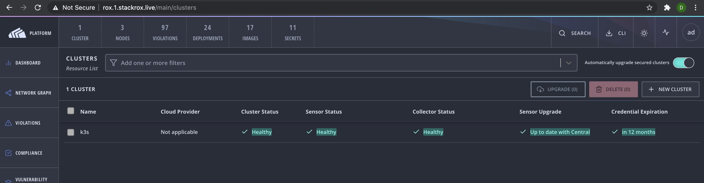

# StackRox Workshop

#### clemenko@stackrox.com | [@clemenko](https://twitter.com/clemenko)

## Agenda

- Quick Intro
- Access to VMS
- Simple Kubernetes deployment - K3s
  - Ingress
  - Storage
- StackRox
  - Install
    - Interactive / Automated
  - Authentication
  - Policies
    - Stages
  - Integrations
  - API & Tokens
  - Troubleshooting
- Demo

### Workshop Pre-requisites

- Basic Linux command line skills
- Familiarity with a text editor (Visual Studio, emacs, vi, etc.)
- Bring your own laptop

## How this workshop works

- ASK QUESTIONS!

## Access to Vms

Every student will get 3 vms to set up as a [k3s](https://k3s.io) cluster. The instructor will assign the student a number. To connect with a root password of `Pa22word`:

```bash
ssh root@student1a.stackrox.live
```

## K3s

Lets deploys [k3s](https://k3s.io). From the 1A node we will run all the commands. Don't for get to set the student number.

```bash
# set student number
export num=1
# get ip addresses
export ipa=$(dig +short student1a.stackrox.live)
export ipb=$(dig +short student1b.stackrox.live)
export ipc=$(dig +short student1c.stackrox.live)

# make kube dir
mkdir ~/.kube

# k3sup install
k3sup install --ip $ipa --user root --k3s-extra-args '--no-deploy traefik' --cluster --local-path ~/.kube/config
k3sup join --ip $ipb --server-ip $ipa --user root
k3sup join --ip $ipc --server-ip $ipa --user root

# Wait about 30 seconds to see the nodes are coming online.

kubectl get node -o wide
```

At this point you should see something similar.

```bash
root@student1a:~# kubectl get node -o wide
NAME        STATUS   ROLES    AGE     VERSION         INTERNAL-IP       EXTERNAL-IP   OS-IMAGE             KERNEL-VERSION     CONTAINER-RUNTIME
student1a   Ready    master   4m31s   v1.18.10+k3s1   157.245.222.116   <none>        Ubuntu 20.04.1 LTS   5.4.0-45-generic   containerd://1.3.3-k3s2
student1b   Ready    <none>   48s     v1.18.10+k3s1   104.131.182.136   <none>        Ubuntu 20.04.1 LTS   5.4.0-45-generic   containerd://1.3.3-k3s2
student1c   Ready    <none>   39s     v1.18.10+k3s1   157.245.222.126   <none>        Ubuntu 20.04.1 LTS   5.4.0-45-generic   containerd://1.3.3-k3s2
```

congrats you just built a 3 node k3s(k8s) cluster. Not that hard right?

## Ingress

If you can't tell I like easy and simple. This also applies to Ingress. For that [Traefik](https://traefik.io/) for the win!

```bash
# install Traefik CRD for TLS passthrough
kubectl apply -f https://raw.githubusercontent.com/clemenko/k8s_yaml/master/traefik_crd_deployment.yml

# verify it is up

kubectl get pod -n traefik

# lets create an ingress entry for this. CHANGE the $NUM to your student number.
# and yes there are escape characters.

cat <<EOF | kubectl apply -f -
apiVersion: traefik.containo.us/v1alpha1
kind: IngressRoute
metadata:
  name: traefik-ingressroute
  namespace: traefik
spec:
  entryPoints:
    - web
  routes:
    - match: Host(\`traefik.$NUM.stackrox.live\`)
      kind: Rule
      services:
        - name: traefik
          port: 8080
EOF
```

Now you can navigate in the browser to http://traefik.$NUM.stackrox.live and see the traefik dashboard.

## Storage

Here is the easiest way to build stateful storage on this cluster. [Longhorn](https://longhorn.io) from Rancher is awesome...

```bash
# kubectl apply
kubectl apply -f https://raw.githubusercontent.com/longhorn/longhorn/master/deploy/longhorn.yaml

# patch to make it default

kubectl patch storageclass longhorn -p '{"metadata": {"annotations":{"storageclass.kubernetes.io/is-default-class":"true"}}}'
kubectl patch storageclass local-path -p '{"metadata": {"annotations":{"storageclass.kubernetes.io/is-default-class":"false"}}}'

# to verify that longhorn is the default

kubectl  get sc

# Watch it coming up

watch kubectl get pod -n longhorn-system

# how about a dashboard? CHANGE the $NUM to your student number.
# and yes there are escape characters.

cat <<EOF | kubectl apply -f -
apiVersion: traefik.containo.us/v1alpha1
kind: IngressRoute
metadata:
  name: traefik-ingressroute
  namespace: longhorn-system
spec:
  entryPoints:
    - web
  routes:
    - match: Host(\`longhorn.$NUM.stackrox.live\`)
      kind: Rule
      services:
        - name: longhorn-frontend
          port: 80
EOF

```

Navigate to the dashboard at http://longhorn.$NUM.stackrox.live

Once everything is running we can move on.

## StackRox

Let's look at the architecture


tl:dr three major pieces

- Central
- Scanner
- Sensor/Collector

There are two basic methods of install, Online and Offline. This workshop will assume online. If you are curious about the offline install here is [guide](https://github.com/clemenko/sr_tools/tree/main/stackrox_offline). :D

### Install Online

```bash
# First thing is to set the logins. Yes you should change this to your login at help.stackrox.com. We need this to pull the bits from the authenticated registry. This will be useful even on an air gapped install.

export REGISTRY_USERNAME=andy@stackrox.com
export REGISTRY_PASSWORD=blahblah2020

# Now lets create the yamls from `roxctl`.
# This will output to a directory `central-bundle`.
roxctl central generate k8s pvc --storage-class longhorn --size 30 --license stackrox.lic --enable-telemetry=false --lb-type none

# make note that the admin password for the platform is here
cat central-bundle/password
# add password variable
export password=$(cat central-bundle/password)

# now we can deploy
./central-bundle/central/scripts/setup.sh
kubectl apply -R -f central-bundle/central

# verify central is up
kubectl get pod -n stackrox

# how about a dashboard? CHANGE the $NUM to your student number.
# and yes there are escape characters.

cat <<EOF | kubectl apply -f -
apiVersion: traefik.containo.us/v1alpha1
kind: IngressRouteTCP
metadata:
  name: stackrox-ingresstcp
  namespace: stackrox
spec:
  entryPoints:
    - tcp
  routes:
    - match: HostSNI(\`rox.$NUM.stackrox.live\`)
      services:
        - name: central
          port: 443
  tls:
    passthrough: true
EOF

# navigate to https://rox.$NUM.stackrox.live !

# lets set up the scanner now
./central-bundle/scanner/scripts/setup.sh
kubectl apply -R -f central-bundle/scanner

# verify everything is up
kubectl get pod -n stackrox

# one last step, add the sensors. Again change the $NUM to point to your setup.
# This will create a directory called `sensor-k3s`
roxctl sensor generate k8s -e rox.$NUM.stackrox.live:443 --name k3s --central central.stackrox:443 --insecure-skip-tls-verify --collection-method kernel-module -p $password

# and deploy the sensors
./sensor-k3s/sensor.sh

# watch it come up
watch kubectl get pod -n stackrox

```

Now check the gui at https://rox.$NUM.stackrox.live/main/clusters 



### Authentication

### Policies

#### Stages

### Integrations

### API & Tokens

### Troubleshooting

## Questions, Thoughts...
