# StackRox Workshop

#### clemenko@stackrox.com | [@clemenko](https://twitter.com/clemenko)

## Agenda

- Quick Intro
- Access to VMS
- Simple Kubernetes deployment - K3s
  - Ingress
  - Storage
- StackRox
  - Install Offline
  - Install Online
  - Authentication
  - Policies
    - Stages
  - Integrations & Plugins
  - API & Tokens
  - Documentation
  - Troubleshooting
- Demo

### Workshop Pre-requisites

- Basic Linux command line skills
- Familiarity with a text editor (Visual Studio, emacs, vi, etc.)
- Bring your own laptop

## How this workshop works

- ASK QUESTIONS!

## Access to Vms

Every student will get 3 vms to set up as a [k3s](https://k3s.io) cluster. The instructor will assign the student a number. To connect with a root password of `Pa22word`:

```bash
# Change $NUM to your student number

ssh root@student$NUMa.stackrox.live
```

## K3s

Lets deploys [k3s](https://k3s.io). From the 1A node we will run all the commands. Don't for get to set the student number.

```bash
# set student number
export NUM=1
# get ip addresses
export ipa=$(dig +short student1a.stackrox.live)
export ipb=$(dig +short student1b.stackrox.live)
export ipc=$(dig +short student1c.stackrox.live)

# make kube dir
mkdir ~/.kube

# k3sup install
k3sup install --ip $ipa --user root --k3s-extra-args '--no-deploy traefik' --cluster --local-path ~/.kube/config
k3sup join --ip $ipb --server-ip $ipa --user root
k3sup join --ip $ipc --server-ip $ipa --user root

# Wait about 15 seconds to see the nodes are coming online.

kubectl get node -o wide
```

At this point you should see something similar.

```bash
root@student1a:~# kubectl get node -o wide
NAME        STATUS   ROLES    AGE     VERSION         INTERNAL-IP       EXTERNAL-IP   OS-IMAGE             KERNEL-VERSION     CONTAINER-RUNTIME
student1a   Ready    master   4m31s   v1.18.10+k3s1   157.245.222.116   <none>        Ubuntu 20.04.1 LTS   5.4.0-45-generic   containerd://1.3.3-k3s2
student1b   Ready    <none>   48s     v1.18.10+k3s1   104.131.182.136   <none>        Ubuntu 20.04.1 LTS   5.4.0-45-generic   containerd://1.3.3-k3s2
student1c   Ready    <none>   39s     v1.18.10+k3s1   157.245.222.126   <none>        Ubuntu 20.04.1 LTS   5.4.0-45-generic   containerd://1.3.3-k3s2
```

congrats you just built a 3 node k3s(k8s) cluster. Not that hard right?

## Ingress

If you can't tell I like easy and simple. This also applies to Ingress. For that [Traefik](https://traefik.io/) for the win!

```bash
# install Traefik CRD for TLS passthrough
kubectl apply -f https://raw.githubusercontent.com/clemenko/k8s_yaml/master/traefik_crd_deployment.yml

# verify it is up

kubectl get pod -n traefik

# lets create an ingress entry for this. CHANGE the $NUM to your student number.
# and yes there are escape characters.

cat <<EOF | kubectl apply -f -
apiVersion: traefik.containo.us/v1alpha1
kind: IngressRoute
metadata:
  name: traefik-ingressroute
  namespace: traefik
spec:
  entryPoints:
    - web
  routes:
    - match: Host(\`traefik.$NUM.stackrox.live\`)
      kind: Rule
      services:
        - name: traefik
          port: 8080
EOF
```

Now you can navigate in the browser to http://traefik.$NUM.stackrox.live and see the traefik dashboard.

## Storage

Here is the easiest way to build stateful storage on this cluster. [Longhorn](https://longhorn.io) from Rancher is awesome...

```bash
# kubectl apply
kubectl apply -f https://raw.githubusercontent.com/longhorn/longhorn/master/deploy/longhorn.yaml

# patch to make it default

kubectl patch storageclass longhorn -p '{"metadata": {"annotations":{"storageclass.kubernetes.io/is-default-class":"true"}}}'
kubectl patch storageclass local-path -p '{"metadata": {"annotations":{"storageclass.kubernetes.io/is-default-class":"false"}}}'

# to verify that longhorn is the default storage class

kubectl get sc

# Watch it coming up

watch kubectl get pod -n longhorn-system

# how about a dashboard? CHANGE the $NUM to your student number.
# and yes there are escape characters.

cat <<EOF | kubectl apply -f -
apiVersion: traefik.containo.us/v1alpha1
kind: IngressRoute
metadata:
  name: traefik-ingressroute
  namespace: longhorn-system
spec:
  entryPoints:
    - web
  routes:
    - match: Host(\`longhorn.$NUM.stackrox.live\`)
      kind: Rule
      services:
        - name: longhorn-frontend
          port: 80
EOF

```

Navigate to the dashboard at http://longhorn.$NUM.stackrox.live

Once everything is running we can move on.

## StackRox

Let's look at the architecture


tl:dr three major pieces

- Central
- Scanner
- Sensor/Collector

There are two models we can use when deploying the platform. Hub and Spoke or Decoupled. I highly recommend deploying in a decoupled model. Decoupled means that every kubernetes cluster will get their own Central. This will allow for greater flexibility and stability.

There are two basic methods of install, Online and Offline. This workshop will assume online. If you are curious about the offline install here is [guide](https://github.com/clemenko/sr_tools/tree/main/stackrox_offline). :D

### Install Offline assuming no registry

For this workshop we have preloaded the offline tar for you. Here is a script that can help automate getting all the parts: https://github.com/clemenko/sr_tools/blob/main/stackrox_offline/getoffline_stackrox.sh.

```bash
# uncompress the complete bundle
tar -zvxf all_the_things_3.0.50.0.tar.gz

# uncompress the smaller tars
cd stackrox_offline
tar -zxvf stackrox_offline_3.0.50.0.tgz
tar -zxvf image-collector-bundle_3.0.50.0.tgz

# load the images onto every node
for i in $(ls image-bundle/*.img); do docker load -i $i; done
for i in $(ls image-collector-bundle/*.img); do docker load -i $i; done

# when running the `roxctl` command make sure to add `--offline` and `--enable-telemetry=false`

# run sed to remove image pull secrets

# create namespace ahead of time
kubectl create ns stackrox

# skip the `setup.sh` and apply away

```

### Install Online

```bash
# First thing is to set the logins. Yes you should change this to your login at help.stackrox.com. We need this to pull the bits from the authenticated registry. This will be useful even on an air gapped install.

export REGISTRY_USERNAME=andy@stackrox.com
export REGISTRY_PASSWORD=blahblah2020

# Now lets create the yamls from `roxctl`.
# This will output to a directory `central-bundle`
# -- don't forget to add `--offline` to this command if you are offline --
roxctl central generate k8s pvc --storage-class longhorn --size 30 --license stackrox.lic --enable-telemetry=false --lb-type none

# make note that the admin password for the platform is here
cat central-bundle/password
# add password variable
export password=$(cat central-bundle/password)

# now we can deploy
./central-bundle/central/scripts/setup.sh
kubectl apply -R -f central-bundle/central

# verify central is up
kubectl get pod -n stackrox

# how about a dashboard? CHANGE the $NUM to your student number.
# and yes there are escape characters.

cat <<EOF | kubectl apply -f -
apiVersion: traefik.containo.us/v1alpha1
kind: IngressRouteTCP
metadata:
  name: stackrox-ingresstcp
  namespace: stackrox
spec:
  entryPoints:
    - tcp
  routes:
    - match: HostSNI(\`rox.$NUM.stackrox.live\`)
      services:
        - name: central
          port: 443
  tls:
    passthrough: true
EOF

# navigate to https://rox.$NUM.stackrox.live !

# lets set up the scanner now
./central-bundle/scanner/scripts/setup.sh
kubectl apply -R -f central-bundle/scanner

# verify everything is up
watch kubectl get pod -n stackrox

# one last step, add the sensors. Again change the $NUM to point to your setup.
# This will create a directory called `sensor-k3s`
roxctl sensor generate k8s -e rox.$NUM.stackrox.live:443 --name k3s --central central.stackrox:443 --insecure-skip-tls-verify --collection-method kernel-module -p $password

# and deploy the sensors
./sensor-k3s/sensor.sh

# watch it come up
watch kubectl get pod -n stackrox

```

Now check the gui at https://rox.$NUM.stackrox.live/main/clusters 

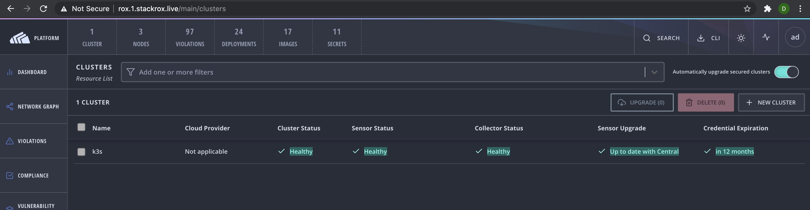

### Authentication

### Policies

Out of the box StackRox ships with 64 System Policies. Navigate to https://rox.1.stackrox.live/main/policies to see the policies. Or click **PLATFORM CONFIGURATION --> SYSTEM POLICIES**.

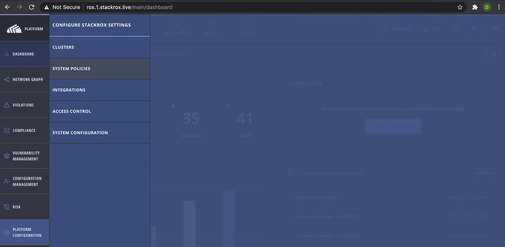

While we can edit the policies, I would suggest looking at the import/export features. This is will allow for greater automation of clusters.

Lets edit a policy the `nmap Execution` policy. Search for it in the search field.

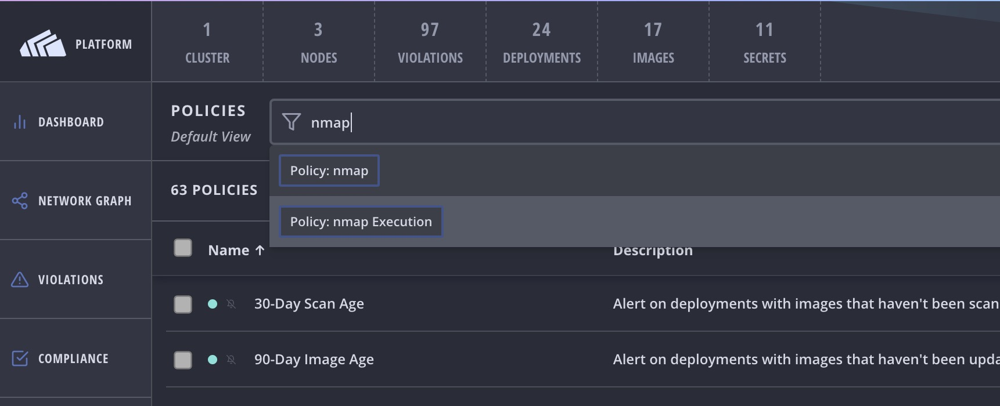

From there we can click on the policy and then click edit it the top right.

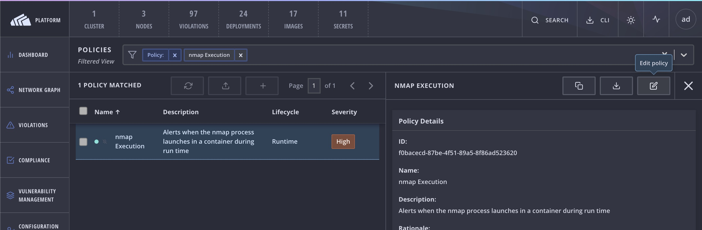

With the edit tab open click the right arrow to get to the next page. This is the Policy Criteria page. Click it again to see the Violations Preview page. Click again to see the Execution page. Scroll down and enable the Runtime Execution. Click the disk icon to Save the policy.

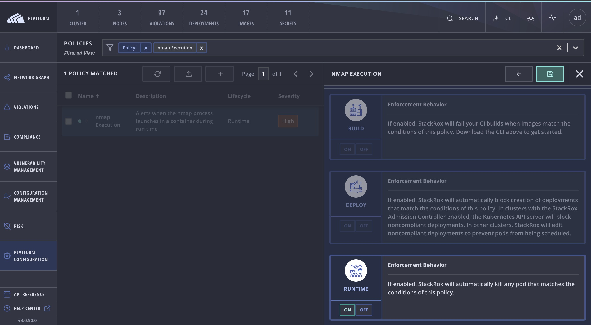

We know have Runtime enforcement for nmap execution.

#### Stages

Stages refers to the different policy stages. As with the example for the `nmap Execution` policy we can start to see the three stages for policies. The three stages are:

- Build - Focused on CI/CD interaction with Central/Scanner
- Deploy - Admission Controller
- Runtime - Dynamic Runtime defense

Each stage has policies uniquely written for it. Some policies are geared for the Build and Deploy stage.

### Integrations & Plugins

The StackRox platform is not a walled garden of knowledge! Navigate to **PLATFORM CONFIGURATION --> INTEGRATIONS** or https://rox.1.stackrox.live/main/integrations.

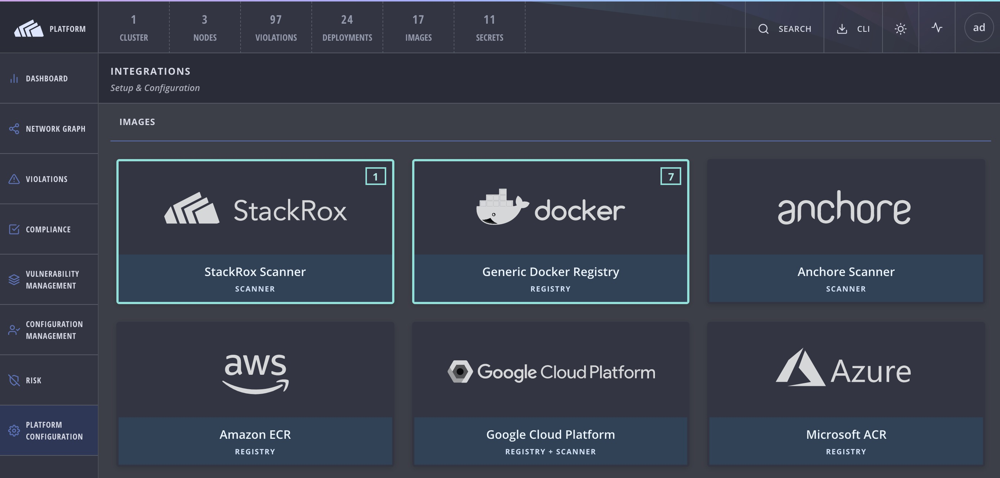

Here we can edit the integrations for setting up external scanners, registries, Slack, Jira, and other plugins.

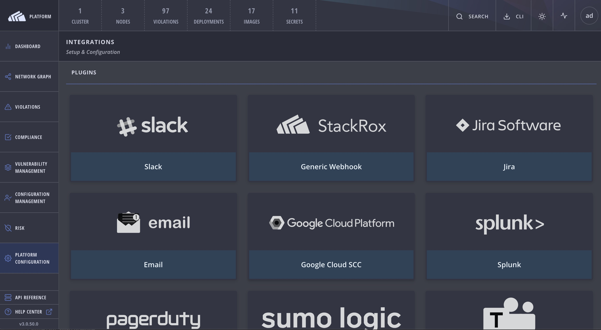

This is also the page where we can create an API Token for use with curl or the Jenkins plugin.

### API & Tokens

The StackRox platform ships with a completely documented API interface. In the lower left hand corner click the **API REFERENCE** button

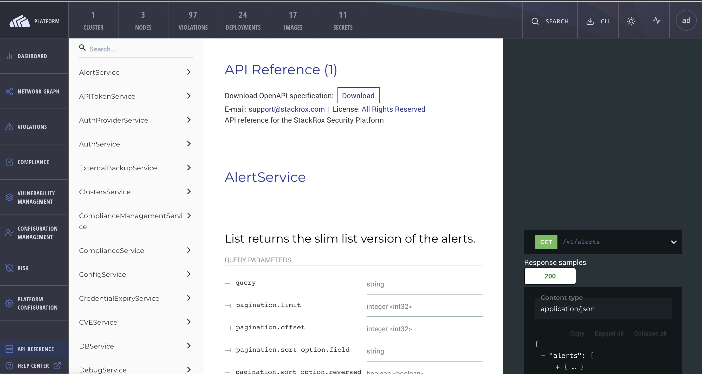

We can navigate to **PLATFORM CONFIGURATION --> INTEGRATIONS** and scroll down to **AUTHENTICATION TOKENS**. Once there click the plus symbol in the upper right hand of the page. Here we can create a token with a specific role.

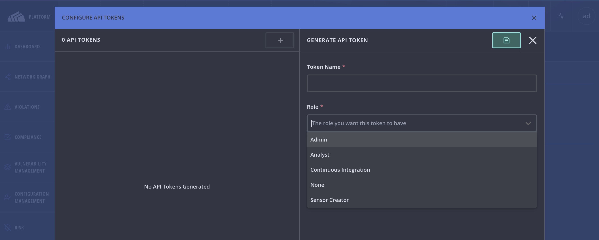

OR...

```bash
# lets create a toke with the API.
curl -sk -X POST -u admin:$password https://rox.$NUM.stackrox.live/v1/apitokens/generate -d '{"name":"jenkins","role":null,"roles":["Continuous Integration"]}'| jq -r .token > jenkins_API_TOKEN

# we can export it as a variable for use with roxctl
export ROX_API_TOKEN=$(cat jenkins_API_TOKEN)
```

#### Scanner Integration

There are two simple ways to integrate with the StackRox scanner. The first way is with the Jenkins plugin. We may cover that later if there is time. The second way is with the `roxctl` binary. This binary was preinstalled onto the first node ahead of time.

```bash
# verify the api token is ready for use
echo $ROX_API_TOKEN

# now we are ready for asking the scanner to scan an image.
# we can use jq to pretty it up
# keep in mind it will take about 30 seconds to complete
roxctl image scan -e rox.$NUM.stackrox.live:443 --image "clemenko/jenkins" --insecure-skip-tls-verify | jq .

# we can also use the check function to check the image against Build System Policies
roxctl image check -e rox.$NUM.stackrox.live:443 --image "clemenko/jenkins" --insecure-skip-tls-verify

# here is a sample output
✗ Image clemenko/jenkins failed policy 'Fixable CVSS >= 7' (policy enforcement caused failure)
- Description:
    ↳ Alert on deployments with fixable vulnerabilities with a CVSS of at least 7
- Rationale:
    ↳ Known vulnerabilities make it easier for adversaries to exploit your
      application. You can fix these high-severity vulnerabilities by updating to a
      newer version of the affected component(s).
- Remediation:
    ↳ Use your package manager to update to a fixed version in future builds or speak
      with your security team to mitigate the vulnerabilities.
- Violations:
    - Fixable CVE-2012-0785 (CVSS 7.5) found in component 'jenkins' (version 1.1), resolved by version 1.424.2
    - Fixable CVE-2012-4438 (CVSS 8.8) found in component 'jenkins' (version 1.1), resolved by version 1.466.2
    - Fixable CVE-2020-10518 (CVSS 8.8) found in component 'github' (version 1.31.0), resolved by version 2.19.21

Error: Violated a policy with CI enforcement set

```

### Documentation

Similar to the API, the StackRox platform ships with a copy of the complete documentation. In the lower left hand corner click the **HELP CENTER** button. Or Navigate to https://rox.$NUM.stackrox.live/docs/product/

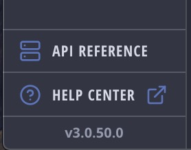

### Troubleshooting

When troubleshooting StackRox there are two main tools to use. The first one is using kubectl to validate the Central pod is running. Ate the same time we can validate that all the pods are running correctly. Make sure you run the `kubectl` command on the cluster where the components are installed.

```bash
root@student1a:~# kubectl get pod -n stackrox
NAME                          READY   STATUS    RESTARTS   AGE
scanner-db-7964d4794d-ktvmm   1/1     Running   0          80m
central-57c48f8fdc-mmmsq      1/1     Running   0          81m
scanner-96bfb87df-hcr5b       1/1     Running   0          80m
scanner-96bfb87df-h5dfr       1/1     Running   0          80m
collector-2mhfh               2/2     Running   0          79m
collector-8j77w               2/2     Running   0          79m
collector-mp954               2/2     Running   0          79m
sensor-5ccbc8858d-kkndf       1/1     Running   0          79m
```

The second tool is using Central's gui. The gui can help show the current stat of all the components as well.

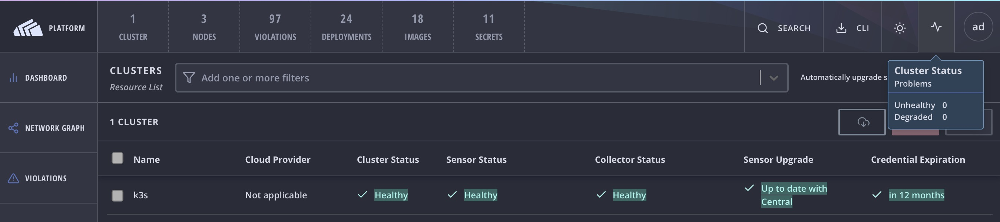

### Bonus Tips

#### Classification Banners

The settings for the classification banners are located in **PLATFORM CONFIGURATION --> SYSTEM CONFIGURATION**. Here you can change all the settings as needed.

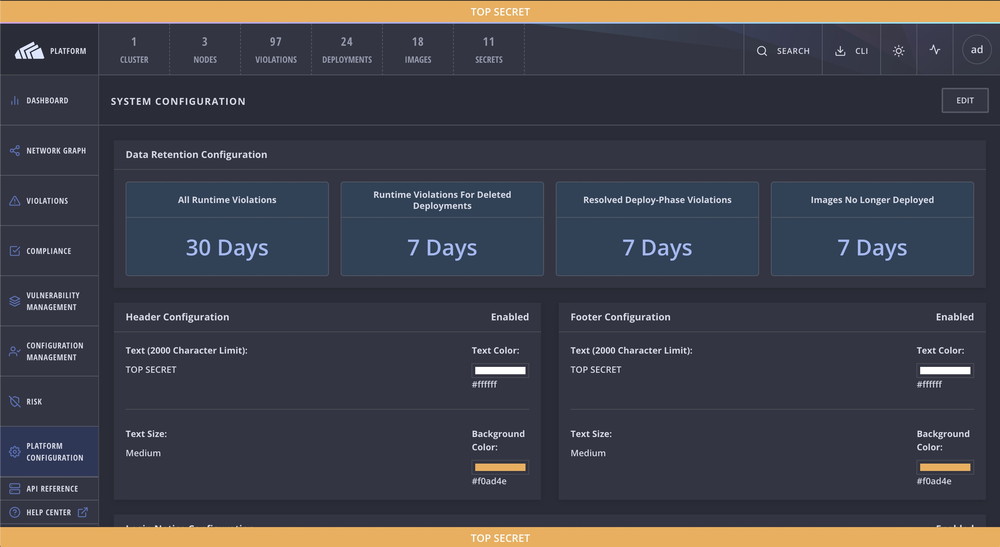

OR you can use a handy script in this repo.

```bash
# get the script
wget https://raw.githubusercontent.com/clemenko/sr_tools/main/stackrox_classifications.sh
chmod 755 stackrox_classifications.sh

# we need to change the server in the script
sed -i 's/stackrox.dockr.life/rox.$NUM.stackrox.live/g' stackrox_classifications.sh

# now we can run it for the 
./stackrox_classifications.sh TS

## Questions, Thoughts...
